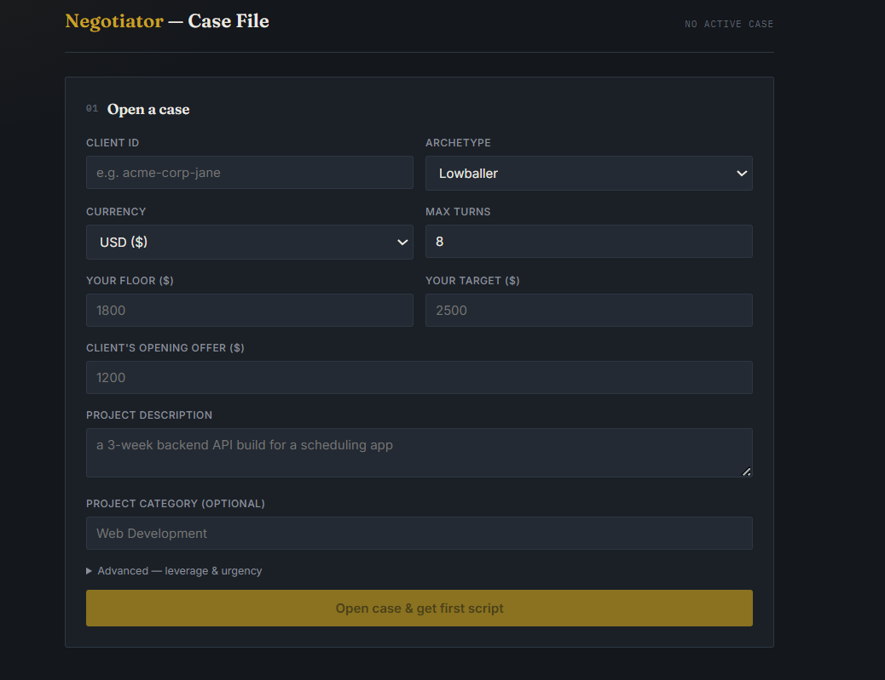
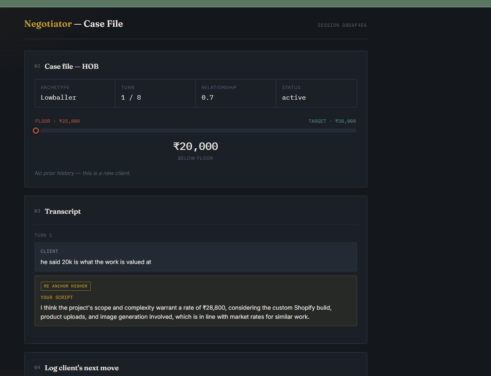

# NegotiateAI — Freelancer Negotiation Agent

Say you're a freelance web developer. A client offers you ₹20,000 for a
month-long Shopify build — product uploads, image generation, the works.
You know that's low, but low compared to what, exactly? You don't have a
market-rate sheet in your head. You don't remember exactly how this client
negotiated last time, or if you've even worked with them before. And you
definitely don't want to sound desperate or come off greedy in your reply.

That's the actual problem this project solves. NegotiateAI sits in that
moment: it knows what similar projects actually go for (real market-rate
data, not a guess), it remembers how this specific client has negotiated
with you before, it reads the tone of what they just said, and it hands
you an actual message to send — in a strategy chosen by a trained RL
policy, not just "sound firm."

An RL + NLP + LLM system that coaches freelancers through real payment
negotiations in real time.

**Status:** Weeks 1–12 complete. One open item: retraining the RL policy
after a Week 3–4 environment fix (see below).

---

## What it actually does

1. You open a "case" — client ID, archetype, your floor/target, the
   client's opening offer.
2. Each turn, you log what the client said (and their new number, if any).
3. A DistilBERT tone classifier reads the message, a PPO policy picks a
   strategy (hold, re-anchor, concede, add value, set boundary, walk away),
   and Groq/Llama writes the actual message you send — grounded in real
   market-rate data (RAG over a Kaggle freelance-rates dataset) and this
   specific client's history with you, if they're a repeat.
4. When it's over, the outcome is saved, so next time this client shows up,
   the agent already knows how they negotiate.

## Architecture

```
env/        Gymnasium simulation environment + 5 client archetypes
            (rule-based, for training the RL policy fast — thousands of
            episodes/sec, no LLM in the hot loop)
agent/      PPO training + saved policies (stable-baselines3)
nlp/        DistilBERT tone classifier (8 signal classes) — feeds the
            RL policy's sentiment_score observation
llm/        Groq (Llama 3.3 70B) script generator + market-rate RAG
            retriever (ChromaDB) — numbers are always decided by code,
            never invented by the LLM
memory/     SQLite, per-client negotiation history (not per-archetype —
            "this specific client" memory, not "lowballers in general")
api/        FastAPI backend gluing all of the above behind HTTP endpoints
frontend/   React "case file" UI — deal gauge, transcript, script variants
```

Pipeline for a live turn:

```
client message ──► sentiment classifier ──┐
                                            ├──► 13-float state vector ──► PPO policy ──► action
client's offer ─────────────────────────► ┘                                                │
                                                                                             ▼
market RAG (ChromaDB) ──┐                                                          Groq script generator
client history (SQLite) ┴──────────────────────────────────────────────────────────────────┘
                                                                                             │
                                                                                             ▼
                                                                                   ready-to-send script
```

## Tech stack

| Layer | Tech |
|---|---|
| RL environment | Gymnasium, custom reward shaping |
| RL policy | PPO (stable-baselines3) |
| Tone classification | DistilBERT (transformers, fine-tuned) |
| Script generation | Groq API, Llama 3.3 70B |
| Market-rate RAG | ChromaDB + sentence-transformers, LangChain |
| Memory | SQLite, per-client |
| Backend | FastAPI |
| Frontend | React + Vite, plain CSS (no framework) |
| Deployment | Docker Compose (FastAPI + nginx-served static build) |

## Running it

### Local dev

```bash
pip install -r requirements.txt
cp .env.example .env        # add GROQ_API_KEY
uvicorn api.main:app --reload

cd frontend
npm install
npm run dev
```

### Docker

```bash
docker compose up -d --build
```

Backend: `http://localhost:8000` (docs at `/docs`) · Frontend: `http://localhost:3000`

First build is slow — torch, transformers, and chromadb add up to a
multi-GB image. See `DOCKER.md` for setup details.

---

## Screenshots


*Starting a new negotiation — archetype, currency, floor/target, and the
client's opening offer.*



*A few turns in — each client message paired with the strategy the policy
picked (re-anchor higher, add value, etc.) and the actual script generated
for it.*

---

## Issues I actually ran into

**Docker Desktop just... stopped responding.** While chasing down a port
conflict, I killed what I thought was a stray leftover process on port
8000 — turned out that PID was `com.docker.backend`, Docker Desktop's own
engine process, not anything from this project. Every `docker` command
after that returned a 500 from the daemon, even `docker version`. A
regular restart didn't fix it — needed Docker Desktop's own repair option
(Settings → Troubleshoot → Restart Docker Desktop) to actually bring the
backend VM back to a working state. Nothing about the project itself was
broken; it was purely a "don't kill processes you haven't identified"
lesson.

**The deal would never actually close.** For a while, negotiations kept
running the full 8 turns and force-ending without an agreement, even when
the agent kept conceding on price turn after turn. Traced it back to the
environment logic: the `concede_partial` action was hardcoded to never set
`deal_closed = True`, in every single client archetype. It could nudge the
price down, but it could never actually win the negotiation — so any
episode where the agent leaned on that move was structurally guaranteed to
run out the clock. Fixed by giving each archetype a real, tuned chance to
accept when you concede (higher for archetypes like Lowballer and Scope
Creeper, lower for Ghoster), instead of zero across the board.

---

That's NegotiateAI — built solo over 2-3 weeks, bugs and all, documented
above rather than hidden.

— Jai Agrawal
[LinkedIn](https://www.linkedin.com/in/jai-agrawal-a81319285/)